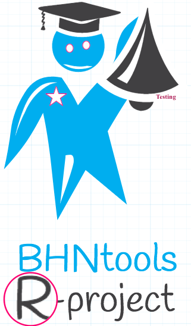

<html>
<head>
  <meta charset="utf-8" />
  <title>BHNtools-R-Tests</title>
  
</head>

<body>
<article>
  

    <header>
        <section style="color:blue;float:right;padding-right:20px;">
        
        </section>
        <section style="color:navy;float:left;padding-left:15px;">
        <h1>BHNtools-R :: Testing</h1>

 

<section id="content"style="color:black;float:left;">
<h1 id='idtitle1'>I. What is this?</h1>
<H6>Trying and testing packages and repositories with R project.

<h1 id='idtitle4'>II. Issues and Contributing</h1> 
<h2>I.1/ Support</h2>

If you are having issues, please let me know.

<h2>II.2/ Contribute</h2>

Bug reports, bug fixes, and new features are always welcome. 
* Issue Tracker: github 
* Source Code: github

<h2 id='idtitleE'>III.3/ Authors and Maintainers</h2>

Najla BEN HASSINE : <a href="MAILTO:bhndevtools@gmail.com?Subject=DockerBIum">bhndevtools@gmail.com</a>

<section style="font: bold;color:green;align:center;font-size:small;">
<footer>BHNtools-copyright2016©</footer>
</section>
</section>
</article>
<aside style='float:right; font:bold; color:navy; align:center; font-size:small; border: 1.5px solid; border-radius:20px; width:200px;'>
<!--div style="font:bold;color:navt;align:center;font-size:small; border: 2px solid; border-radius:25px;"-->

Topics
 
<a href=#idtitle1>I. What is this?</a>
 
<a href=#idtitle4>II. Issues and Contributing</a>

</aside>
</body>
</html>
