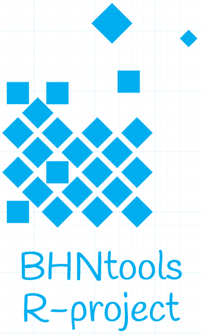

<html>
<head>
  <meta charset="utf-8" />
  <title>BHNtools-R</title>
  
</head>
<header>
        <h2 style="padding-left:5px;;padding-right:5px;" >BHNtools-R </h2>
</header>

      

        <section id="main-content">
            <aside style='float:right; width:350px;'>
                <article style="aling:center;">
                <h3 id='idtitle1'>I. What is this?</h3>
                <H4 style="color:navy; align:center;">Developing, Trying and Testing R packages.</H4>
                <h3 id='idtitle2'>II. Projects</h3>
                    <h4 id='subidtitle2'>II.1/ StackOverflow scripts</h4>
                    <em> - <strong>ggplot2Sizing.R : </strong></em>Plotting p-values with ggplot2.
                <h3 id='idtitle4'>III. Issues and Contributing</h3>
                <h4>III.1/ Contribute</h4>
                
Bug reports, bug fixes, and new features are always welcome. 
                * Issue Tracker: <a href="https://github.com/BHNtools/BHNtools-R/issues">github</a> 
                * Source Code: <a href="https://github.com/BHNtools/BHNtools-R">github</a>

                <h4 id='idtitleE'>III.2/ Authors and Maintainers</h4>
                
Najla BEN HASSINE : <a href="MAILTO:bhndevtools@gmail.com?Subject=DockerBIum">bhndevtools@gmail.com</a>

                <section style="font:bold;color:green;align:center;font-size:small;">
                BHNtools-copyright©2016
                </section>
                </article>
            </aside>
            <aside id="sidebar" style="color:blue;float:left;padding-right:1px;">
            
BHNtools-R

              <a href="https://github.com/BHNtools/BHNtools-R/zipball/master" class="button">
                <small>Download</small>
                .zip file
              </a>
              <a href="https://github.com/BHNtools/BHNtools-R/tarball/master" class="button">
                <small>Download</small>
                .tar.gz file
              </a>
            
<strong>BHNtools-R</strong> is maintained by <a href="https://github.com/BHNtools">BHNtools</a>.

            
This page was generated by <a href="https://pages.github.com">GitHub Pages</a> Based on <a href="https://twitter.com/jasonlong"> - Jason Long </a>theme

                 
                 
                 
                <aside style='float:left; font:bold; color:navy; align:center; font-size:small; border: 1.5px solid; border-radius:20px; width:200px;'>
                
Topics
                 
                 
                <a href=#idtitle1>I. What is this?</a>
                 
                <a href=#idtitle2>II. Projects</a>
                     
                    <a href=#subidtitle2>II.1-Stackoverflow</a>
                 
                <a href=#idtitle4>II. Issues and Contributing</a>
                

                </aside>
            </aside>
            <aside style="color:blue;float:left;padding-right:2px;padding-left:2px;">

            
            
            </aside>
      </section>
    

  

  </body>
</html>